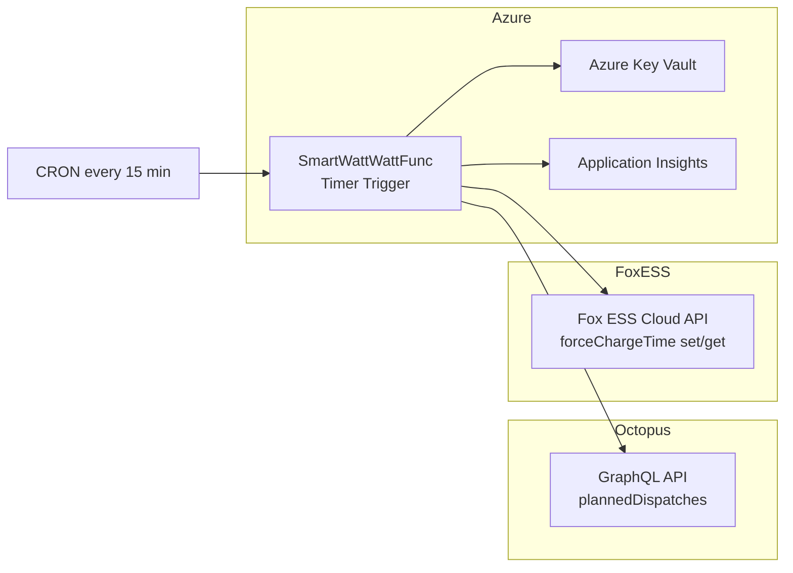
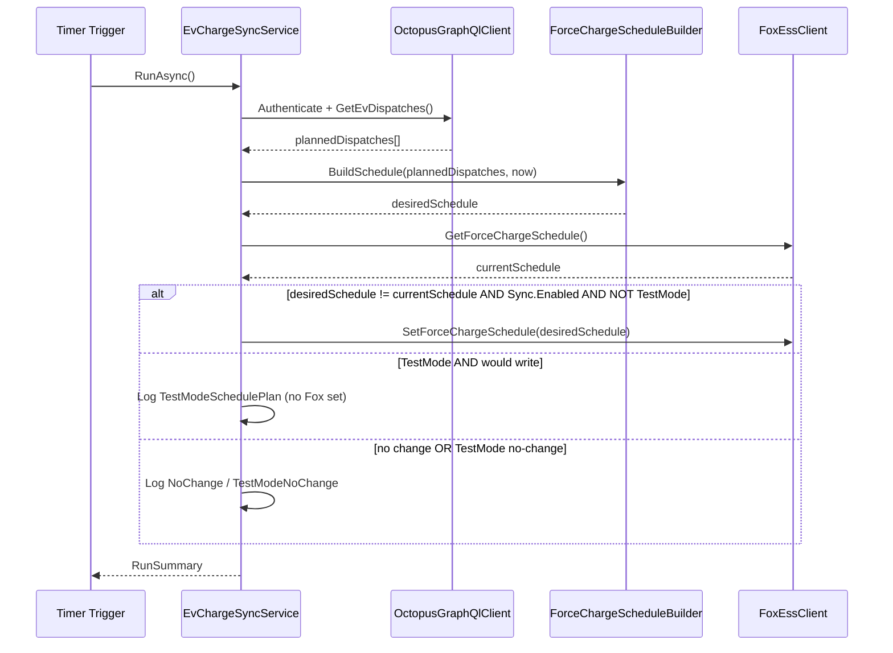

# SmartWattWattFunc — Specification

| Field | Value |
|---|---|
| **Document version** | 1.2 (draft for review) |
| **Status** | Ready for implementation |
| **Last updated** | 2026-07-12 |
| **Component** | `SmartWattWattFunc` |
| **Runtime** | Azure Functions (.NET 8, isolated worker) |

---

## 1. Purpose

**SmartWattWatt** is a home-energy application suite that coordinates electricity supply data with battery/inverter control.

**SmartWattWattFunc** is the first component: a timer-driven Azure Function that runs every **15 minutes**, retrieves EV charging windows from the **Octopus Energy GraphQL API**, and manages the **Fox ESS Force Charge schedule**.

The function **always** maintains Force Charge in the **default overnight windows** unless Octopus returns `plannedDispatches` that fall **outside** that coverage. It then dynamically repurpose the two Force Charge slots on each run to fit those dispatches, while preserving overnight Force Charge coverage wherever possible.

**Default windows** (combined coverage **23:30 – 05:30** local):

| Slot | Window | Purpose |
|---|---|---|
| 1 | **23:30 – 23:59** | Start of overnight Force Charge (API cannot extend a single slot past 23:59) |
| 2 | **00:00 – 05:30** | Continuation after midnight through end of overnight period |

**Adjustment rule:** Only when a `plannedDispatch` falls outside 23:30–05:30 does the function repurpose slots — typically replacing slot 1 (after it has passed for the night) with the outside dispatch window, while keeping slot 2 at 00:00–05:30.

When all `plannedDispatches` have completed, the schedule is restored to the default windows.

This document defines the specification for review **before** any implementation begins.

---

## 2. Goals and non-goals

### 2.1 Goals (MVP)

| # | Goal |
|---|---|
| G1 | Run reliably on a 15-minute CRON schedule in Azure |
| G2 | Authenticate to Octopus Energy GraphQL and Fox ESS Cloud using secrets from Azure Key Vault |
| G3 | Retrieve EV charging windows via Octopus `plannedDispatches` (and `completedDispatches` for context) |
| G4 | Classify each `plannedDispatch` as inside or outside the default 23:30–05:30 coverage period |
| G5 | Read the current Fox ESS Force Charge time settings |
| G6 | Keep or restore the **default** Force Charge windows when all dispatches fit within 23:30–05:30 |
| G7 | **Repurpose slot 1** for outside-default dispatches after midnight, keeping slot 2 at 00:00–05:30 where possible |
| G8 | Restore default windows when all `plannedDispatches` have completed |
| G9 | Emit structured logs and a per-run summary suitable for monitoring and debugging |
| G10 | Support a **TestMode** configuration that runs the full decision pipeline but suppresses Fox ESS writes, emitting verbose slot-change and API-call logs for safe local validation |

### 2.2 Non-goals (MVP)

| # | Non-goal | Rationale |
|---|---|---|
| NG1 | Web UI or mobile app | Separate future component |
| NG2 | Multi-tenant / multi-property support | Single home installation for MVP |
| NG3 | Octopus REST tariff or consumption APIs | EV schedule comes from GraphQL only |
| NG4 | Modifying the Octopus EV charging schedule | Read-only from Octopus; Fox ESS is the write target |
| NG5 | Fox ESS OAuth user-consent flow | Private API token is sufficient for personal server-side automation |
| NG6 | Sub-minute precision | 15-minute polling is sufficient |
| NG7 | Mode Scheduler segment management | Use Force Charge time API (2-window grid charging schedule) |

---

## 3. Assumptions

| ID | Assumption |
|---|---|
| A1 | The property uses **Intelligent Octopus** (or equivalent Krakenflex-managed EV charging) with dispatches exposed via GraphQL |
| A2 | The property has a **Fox ESS** hybrid inverter/battery accessible via Fox ESS Cloud |
| A3 | The function runs in **Azure** with access to **Azure Key Vault** via Managed Identity |
| A4 | The Octopus account API key and account number are known |
| A5 | The Fox ESS device serial number (`sn`) is known |
| A6 | MVP targets a **single home** (one Octopus account, one EV, one Fox ESS inverter) |
| A7 | Fox ESS Force Charge is controlled via `/op/v0/device/battery/forceChargeTime/set` (two time-window slots) |
| A8 | Octopus dispatch timestamps are converted to **`Europe/London`** local time for Fox ESS hour/minute fields |
| A9 | A single Force Charge slot **cannot end after 23:59**; periods crossing midnight must use slot 2 starting at **00:00** |

---

## 4. Resolved and open questions

### 4.1 Resolved

| ID | Decision |
|---|---|
| Q1 | **Primary objective:** Read EV `plannedDispatches` from Octopus GraphQL; mirror on Fox ESS Force Charge schedule |
| Q2 | **Fox ESS mode during EV charging:** **ForceCharge** — implemented by setting Force Charge time windows to match dispatch times |
| Q3 | **After dispatches complete:** Restore default Force Charge windows — **23:30–23:59** and **00:00–05:30** |
| Q4 | **Timezone for Fox ESS windows:** `Europe/London` — convert Octopus UTC `startDt`/`endDt` to local time |
| Q5 | **Scheduling strategy:** Always maintain default 23:30–05:30 Force Charge coverage. Only repurpose slots when `plannedDispatches` fall **outside** that window. Slot 1 is repurposed after 00:00; slot 2 stays at 00:00–05:30. See §11 and §12. |
| Q6 | **No dispatch windows / Octopus unavailable:** Enforce default schedule at **any** execution time if not already set. See Scenario 3 (§12). |
| Q7 | **Daytime pre-scheduling:** When idle in the daytime gap, pre-schedule slot 1 = next dispatch, slot 2 = second or default. See Scenario 4 (§12). |
| Q8 | **Multiple outside-default dispatches:** Progressively stage outside-default windows into slots during the overnight cycle. See Scenario 5 (§12). |
| Q9 | **Fail-safe when Fox ESS write fails:** Log error; retry on next scheduled run (no in-run retry loop) |
| Q10 | **Notification on failure:** Application Insights alert only (no email/Teams for MVP) |
| Q11 | **TestMode vs Sync.Enabled:** `Sync__TestMode` suppresses Fox ESS **set** calls and emits verbose slot/API logs. `Sync__Enabled=false` is a simple dry-run (minimal log only). When TestMode is on, Fox ESS writes are suppressed regardless of `Sync__Enabled`. Octopus fetch and Fox ESS **get** still run so comparisons use live data |

### 4.2 Still open (please verify)

_None — all questions resolved._

---

## 5. System context



---

## 6. Monorepo layout (proposed)

```
SmartWattWatt/
├── docs/
│   └── specs/
│       └── SmartWattWattFunc.md
├── src/
│   └── SmartWattWattFunc/
│       ├── SmartWattWattFunc.csproj
│       ├── Program.cs
│       ├── Functions/
│       │   └── EvChargeSyncTimer.cs
│       ├── Configuration/
│       │   └── ScheduleOptions.cs
│       ├── Integrations/
│       │   ├── Octopus/
│       │   │   ├── IOctopusGraphQlClient.cs
│       │   │   ├── OctopusGraphQlClient.cs
│       │   │   └── Models/
│       │   └── FoxEss/
│       │       ├── IFoxEssClient.cs
│       │       ├── FoxEssClient.cs
│       │       └── Models/
│       ├── Services/
│       │   ├── IEvChargeSyncService.cs
│       │   ├── EvChargeSyncService.cs
│       │   ├── ITestModeLogger.cs
│       │   └── TestModeLogger.cs
│       └── Policies/
│           ├── IForceChargeScheduleBuilder.cs
│           └── ForceChargeScheduleBuilder.cs
├── tests/
│   └── SmartWattWattFunc.Tests/
│       ├── Policies/
│       │   ├── ForceChargeScheduleBuilderTests.cs
│       │   └── Scenarios/
│       │       ├── Scenario1_MixedDispatchesTests.cs
│       │       ├── Scenario2_AllInsideDefaultTests.cs
│       │       ├── Scenario3_NoDispatchesTests.cs
│       │       ├── Scenario3_OctopusUnavailableTests.cs
│       │       ├── Scenario4_DaytimePreScheduleTests.cs
│       │       ├── Scenario5_ProgressiveStagingTests.cs
│       │       └── Scenario6_TestModeTests.cs
├── .gitignore
├── SmartWattWatt.sln
└── README.md
```

---

## 7. Azure Function specification

### 7.1 Identity

| Property | Value |
|---|---|
| **Function app name** | `SmartWattWattFunc` (or `{env}-smartwattwatt-func`) |
| **Function name** | `EvChargeSyncTimer` |
| **Trigger type** | Timer |
| **Language** | C# |
| **Worker model** | Isolated (.NET 8) |
| **Hosting plan** | Consumption (MVP) |

### 7.2 Timer schedule

| Property | Value |
|---|---|
| **Interval** | Every 15 minutes |
| **NCRONTAB expression** | `0 */15 * * * *` |
| **`RunOnStartup`** | `false` |
| **`UseMonitor`** | `true` |

### 7.3 Execution characteristics

| Property | Requirement |
|---|---|
| **Timeout** | 5 minutes |
| **Concurrency** | Single logical run per schedule (`UseMonitor`) |
| **Idempotency** | Skip write when desired schedule equals current schedule |

---

## 8. Configuration

### 8.1 Non-secret settings (`local.settings.json` / App Settings)

| Key | Required | Example | Description |
|---|---|---|---|
| `KeyVaultUri` | Yes | `https://myvault.vault.azure.net/` | Key Vault endpoint |
| `Octopus__AccountNumber` | Yes | `A-12345678` | Octopus account number |
| `FoxEss__DeviceSerialNumber` | Yes | `H3-XXXXXXXX` | Inverter serial number |
| `FoxEss__TimeZone` | Yes | `Europe/London` | Timezone for Fox ESS hour/minute conversion (confirmed) |
| `FoxEss__DefaultSlot1Start` | Yes | `23:30` | Default Force Charge window 1 start (local) |
| `FoxEss__DefaultSlot1End` | Yes | `23:59` | Default Force Charge window 1 end (local) |
| `FoxEss__DefaultSlot2Start` | Yes | `00:00` | Default Force Charge window 2 start (local) |
| `FoxEss__DefaultSlot2End` | Yes | `05:30` | Default Force Charge window 2 end (local) |
| `Sync__Enabled` | Yes | `true` | Master switch for writes to Fox ESS |
| `Sync__TestMode` | No | `false` | When `true`, suppress Fox ESS **set** calls and log verbose slot changes and API-call details instead (see §8.3) |
| `Sync__LookAheadHours` | Yes | `24` | Hours ahead to consider upcoming dispatches |
| `Sync__ChargeWindowBufferMinutes` | No | `0` | Optional buffer applied to dispatch boundaries |

### 8.3 TestMode behaviour

`Sync__TestMode` is intended for **local development and pre-deployment validation**. It exercises the full sync pipeline — Octopus fetch, schedule policy, Fox ESS read, and idempotency comparison — but **never calls** the Fox ESS `forceChargeTime/set` endpoint.

**Important:** TestMode **must not** skip the Fox ESS `forceChargeTime/get` call. The live current schedule is always read so slot diffs, idempotency checks, and verbose logs reflect the real device state. Only the **set** endpoint is suppressed.

| Aspect | Production (`TestMode=false`) | TestMode (`TestMode=true`) |
|---|---|---|
| Octopus GraphQL fetch | Yes | Yes |
| Fox ESS `forceChargeTime/get` | Yes | Yes |
| Fox ESS `forceChargeTime/set` | When `Sync__Enabled=true` and schedule differs | **Never** |
| Logging on would-write | Single `Applied Fox ESS schedule` line | Verbose slot diff + redacted API-call log (§8.3.1) |
| `RunSummary.writeApplied` | `true` when set succeeds | Always `false` |
| `RunSummary.testMode` | `false` | `true` |

**Interaction with `Sync__Enabled`:**

| `Sync__Enabled` | `Sync__TestMode` | Fox ESS set | Logging |
|---|---|---|---|
| `true` | `false` | When schedule differs | Standard production logs |
| `false` | `false` | Never | `DryRun` — desired mode only |
| `true` | `true` | Never | Verbose TestMode logs |
| `false` | `true` | Never | Verbose TestMode logs |

When TestMode is enabled, verbose logging takes precedence over the simple `DryRun` message.

#### 8.3.1 Verbose TestMode log payload

When a Fox ESS write **would** be applied, the service logs a structured `TestModeSchedulePlan` entry before returning. When no write is required, it logs a shorter `TestModeNoChange` entry.

**`TestModeSchedulePlan` (would-write):**

```json
{
  "runId": "guid",
  "testMode": true,
  "timestampUtc": "2026-07-13T00:15:00Z",
  "scheduleMode": "OvernightAdjusted",
  "reason": "After 00:00 — repurposed slot 1 for outside-default dispatch 07:30–08:30",
  "slotChanges": [
    {
      "slot": 1,
      "action": "Update",
      "current": { "enabled": true, "start": "23:30", "end": "23:59" },
      "desired": { "enabled": true, "start": "07:30", "end": "08:30" },
      "effectiveWhen": "Immediate on next Fox ESS set call"
    },
    {
      "slot": 2,
      "action": "Unchanged",
      "current": { "enabled": true, "start": "00:00", "end": "05:30" },
      "desired": { "enabled": true, "start": "00:00", "end": "05:30" }
    }
  ],
  "plannedDispatches": [
    { "start": "2026-07-13T02:00:00+01:00", "end": "2026-07-13T05:30:00+01:00", "classification": "InsideDefault" },
    { "start": "2026-07-13T07:30:00+01:00", "end": "2026-07-13T08:30:00+01:00", "classification": "OutsideDefault" }
  ],
  "apiCalls": [
    {
      "operation": "GetForceChargeSchedule",
      "method": "GET",
      "path": "/op/v0/device/battery/forceChargeTime/get",
      "query": { "sn": "H3-XXXXXXXX" },
      "executed": true
    },
    {
      "operation": "SetForceChargeSchedule",
      "method": "POST",
      "path": "/op/v0/device/battery/forceChargeTime/set",
      "executed": false,
      "requestBody": {
        "sn": "H3-XXXXXXXX",
        "enable1": true,
        "enable2": true,
        "startTime1": { "hour": 7, "minute": 30 },
        "endTime1": { "hour": 8, "minute": 30 },
        "startTime2": { "hour": 0, "minute": 0 },
        "endTime2": { "hour": 5, "minute": 30 }
      },
      "headers": {
        "token": "[REDACTED]",
        "timestamp": "[REDACTED]",
        "signature": "[REDACTED]",
        "lang": "en",
        "User-Agent": "SmartWattWatt/1.0"
      }
    }
  ]
}
```

**`TestModeNoChange` (no write required):**

```json
{
  "runId": "guid",
  "testMode": true,
  "timestampUtc": "2026-07-13T00:15:00Z",
  "scheduleMode": "OvernightAdjusted",
  "reason": "Desired schedule already matches Fox ESS",
  "slotChanges": [],
  "apiCalls": [
    {
      "operation": "GetForceChargeSchedule",
      "method": "GET",
      "path": "/op/v0/device/battery/forceChargeTime/get",
      "query": { "sn": "H3-XXXXXXXX" },
      "executed": true
    }
  ]
}
```

**Redaction rules (mandatory):**

| Field | Rule |
|---|---|
| `token` header | Always log `[REDACTED]` |
| `signature` header | Always log `[REDACTED]` |
| `timestamp` header | Log `[REDACTED]` in TestMode API-call logs (value is non-secret but omitted for consistency) |
| Octopus `Authorization` header | Never included in TestMode logs |
| Key Vault secret values | Never included |

Device serial number (`sn`) **may** be logged — it is configuration, not a secret.

**Implementation note:** introduce `ITestModeLogger` (or equivalent) in the service layer so TestMode output is testable without parsing raw `ILogger` string templates. The interface serialises the payloads above and writes them at `LogInformation` level with a fixed event name (`TestModeSchedulePlan` / `TestModeNoChange`).

### 8.2 Secrets (Azure Key Vault)

| Secret name | Description | Used by |
|---|---|---|
| `OctopusApiKey` | Personal Octopus API key | Octopus GraphQL authentication |
| `FoxEssApiToken` | Fox ESS private API token | Fox ESS client (`token` header) |

---

## 9. External API integrations

### 9.1 Octopus Energy GraphQL API

| Property | Value |
|---|---|
| **Endpoint** | `POST https://api.octopus.energy/v1/graphql/` |
| **Documentation** | [GraphQL API basics](https://developer.octopus.energy/guides/graphql/api-basics/) |

#### Authentication

```graphql
mutation APIKeyAuthentication($apiKey: String!) {
  apiKeyAuthentication(apiKey: $apiKey) {
    token
  }
}
```

Subsequent requests use `Authorization: <token>`.

#### Primary query

```graphql
query getEvChargeData($accountNumber: String!) {
  plannedDispatches(accountNumber: $accountNumber) {
    startDt
    endDt
    deltaKwh
    meta {
      source
      location
    }
  }
  completedDispatches(accountNumber: $accountNumber) {
    startDt
    endDt
    deltaKwh
    meta {
      source
      location
    }
  }
  registeredKrakenflexDevice(accountNumber: $accountNumber) {
    chargePointMake
    chargePointModel
    status
    suspended
    vehicleMake
    vehicleModel
  }
}
```

#### Dispatch state detection

| State | Condition |
|---|---|
| **Active dispatch** | `startDt <= nowUtc` AND `endDt > nowUtc` |
| **Upcoming dispatch** | `startDt > nowUtc` AND `startDt <= nowUtc + LookAheadHours` |
| **Completed dispatch** | `endDt <= nowUtc` |
| **Has planned work** | Any `plannedDispatch` is active OR upcoming |
| **All dispatches done** | No `plannedDispatches` are active or upcoming (all have `endDt <= nowUtc`, or list is empty) |

> `plannedDispatches` are the authoritative source for schedule overrides. `completedDispatches` is used for logging and validation only.

---

### 9.2 Fox ESS Force Charge time API

| Property | Value |
|---|---|
| **Base URL** | `https://www.foxesscloud.com` |
| **Documentation** | [Fox ESS Open API](https://www.foxesscloud.com/public/i18n/en/OpenApiDocument.html) |

#### Endpoints used (MVP)

| Operation | Method | Path | Purpose |
|---|---|---|---|
| Get Force Charge schedule | `GET` | `/op/v0/device/battery/forceChargeTime/get` | Read current windows |
| Set Force Charge schedule | `POST` | `/op/v0/device/battery/forceChargeTime/set` | Apply EV or default windows |

#### API constraints

| Constraint | Implication |
|---|---|
| Exactly **two slots** per `set` call | Both `enable1`/`enable2` and all time fields must always be sent |
| Slot 1 **cannot extend past 23:59** | Overnight coverage uses slot 1 (23:30–23:59) + slot 2 (00:00–05:30) |
| Slot 2 starts at **00:00** for post-midnight continuation | Cannot express 23:30–05:30 in a single slot |

#### Default schedule

The **baseline** schedule applied whenever no slot adjustment is required, and restored when all dispatches complete.

| Slot | Enabled | Start (local) | End (local) |
|---|---|---|---|
| 1 | `true` | 23:30 | 23:59 |
| 2 | `true` | 00:00 | 05:30 |

**Combined coverage:** 23:30 → 05:30 (next calendar day).

```json
{
  "sn": "H3-XXXXXXXX",
  "enable1": true,
  "enable2": true,
  "startTime1": { "hour": 23, "minute": 30 },
  "endTime1":   { "hour": 23, "minute": 59 },
  "startTime2": { "hour": 0,  "minute": 0 },
  "endTime2":   { "hour": 5,  "minute": 30 }
}
```

#### Overnight adjusted schedule (Scenario 1 — outside-default dispatch after midnight)

When an outside-default dispatch is in effect after midnight, slot 1 is repurposed:

| Slot | Enabled | Window (example) |
|---|---|---|
| 1 | `true` | Outside dispatch (e.g. 07:30–08:30) |
| 2 | `true` | Default 00:00–05:30 (unchanged) |

```json
{
  "sn": "H3-XXXXXXXX",
  "enable1": true,
  "enable2": true,
  "startTime1": { "hour": 7, "minute": 30 },
  "endTime1":   { "hour": 8, "minute": 30 },
  "startTime2": { "hour": 0, "minute": 0 },
  "endTime2":   { "hour": 5, "minute": 30 }
}
```

#### Pre-scheduled schedule (Scenario 4 — daytime gap, two dispatches)

When idle in the daytime gap with two upcoming dispatches:

| Slot | Enabled | Window (example) |
|---|---|---|
| 1 | `true` | Next dispatch (e.g. 14:00–15:00) |
| 2 | `true` | Second dispatch (e.g. 18:00–19:00), or default 00:00–05:30 if only one dispatch |

```json
{
  "sn": "H3-XXXXXXXX",
  "enable1": true,
  "enable2": true,
  "startTime1": { "hour": 14, "minute": 0 },
  "endTime1":   { "hour": 15, "minute": 0 },
  "startTime2": { "hour": 18, "minute": 0 },
  "endTime2":   { "hour": 19, "minute": 0 }
}
```

#### Timezone conversion

Octopus returns `startDt` and `endDt` as ISO 8601 (typically UTC). Convert to **`Europe/London`** before populating `hour` and `minute` fields. Use `TimeZoneInfo` with correct GMT/BST handling.

---

## 10. Core workflow



### 10.1 Step-by-step

| Step | Action | On failure |
|---|---|---|
| 1 | Load configuration and secrets | Fail fast |
| 2 | Authenticate to Octopus GraphQL | On failure: log error; treat dispatches as `[]`; continue to step 4 |
| 3 | Fetch `plannedDispatches` | On failure: log error; treat dispatches as `[]`; continue to step 4 |
| 4 | Build `desiredSchedule` via `ForceChargeScheduleBuilder` | — |
| 5 | Read current Fox ESS Force Charge schedule | Abort; no Fox writes |
| 6 | Compare `desiredSchedule` vs `currentSchedule` (normalised) | — |
| 7 | If different and `Sync__Enabled` and **not** `Sync__TestMode`, write to Fox ESS | Log result |
| 7a | If different and `Sync__TestMode`, log `TestModeSchedulePlan` (slot diff + redacted API calls); **do not** call Fox ESS set | — |
| 7b | If same and `Sync__TestMode`, log `TestModeNoChange` | — |
| 8 | Write `RunSummary` to logs | — |

### 10.2 Schedule modes

| Mode | When | Slot 1 | Slot 2 |
|---|---|---|---|
| **Default** | No pending dispatches; all inside-default; pre-midnight evening; or all complete | 23:30–23:59 | 00:00–05:30 |
| **OvernightAdjusted** | After 00:00, before 05:30, single outside-default (Scenario 1) | Outside dispatch window | 00:00–05:30 |
| **PreScheduled** | Daytime gap, idle (Scenario 4) | Next pending dispatch | Second pending, or default 00:00–05:30 |
| **ProgressiveStaging** | Multiple outside-default + overnight inside-default (Scenario 5) | Staged outside-default per PS-1–PS-7 | Staged or default per PS-1–PS-7 |

### 10.3 Run summary (log payload)

```json
{
  "runId": "guid",
  "timestampUtc": "2026-07-12T09:00:00Z",
  "octopus": {
    "plannedDispatchCount": 1,
    "hasActiveOrUpcomingDispatches": true,
    "activeWindow": {
      "startDt": "2026-07-12T00:30:00Z",
      "endDt": "2026-07-12T05:00:00Z",
      "deltaKwh": 12.0
    }
  },
  "foxEss": {
    "scheduleMode": "OvernightAdjusted",
    "desiredSchedule": {
      "slot1": { "enabled": true, "start": "07:30", "end": "08:30" },
      "slot2": { "enabled": true, "start": "00:00", "end": "05:30" }
    },
    "currentSchedule": {
      "slot1": { "enabled": true, "start": "23:30", "end": "23:59" },
      "slot2": { "enabled": true, "start": "00:00", "end": "05:30" }
    }
  },
  "decision": {
    "action": "SetForceChargeSchedule",
    "reason": "After 00:00 — repurposed slot 1 for outside-default dispatch 07:30–08:30"
  },
  "writeApplied": true,
  "testMode": false,
  "durationMs": 3100,
  "success": true
}
```

When `Sync__TestMode=true`, `writeApplied` is always `false` and `testMode` is `true`. The verbose slot/API detail is emitted separately as `TestModeSchedulePlan` or `TestModeNoChange` (§8.3.1).

---

## 11. Force Charge schedule policy

### 11.1 Definitions

| Term | Definition |
|---|---|
| **Default coverage period** | 23:30 → 05:30 next calendar day (`Europe/London`) |
| **Default schedule** | Slot 1: 23:30–23:59, Slot 2: 00:00–05:30 (both enabled) |
| **Inside-default dispatch** | A dispatch that ends by **05:30** and does not extend past the overnight period (e.g. 23:00–01:00, 02:00–03:00, 04:00–05:00). No slot adjustment required — default schedule covers these |
| **Outside-default dispatch** | A dispatch with any portion **after 05:30** (e.g. 07:30–08:30) |
| **Daytime gap** | Local time from **05:30** to **23:30** — outside the active default Force Charge period |
| **Pre-midnight evening** | `now` is on the calendar day **before** the next pending dispatch starts (e.g. 22:00 with dispatches tomorrow morning) |
| **Pending dispatch** | `plannedDispatch` where `endDt > now` (local) |
| **Outside-default pending** | Pending dispatch that is outside-default |
| **In default Force Charge window** | `23:30–23:59` or `00:00–05:30` (local) — default slots are actively in effect |
| **In active dispatch** | `startDt <= now < endDt` for any pending dispatch |
| **Outside-default queue** | Pending outside-default dispatches sorted by `startDt` ascending |
| **Uncovered dispatch** | An outside-default dispatch not yet assigned to slot 1 or slot 2 |

### 11.2 ForceChargeScheduleBuilder algorithm

**Inputs:** `plannedDispatches[]`, `now` (Europe/London), default window config.

**Output:** `ForceChargeSchedule { Slot1, Slot2, Mode }` where `Mode` is `Default`, `OvernightAdjusted`, `PreScheduled`, or `ProgressiveStaging`.

```
1. Convert now and all dispatch times to Europe/London.

2. If plannedDispatches is null or empty → return DefaultSchedule

3. pending = plannedDispatches where end > now, sorted by start ascending
   If pending is empty → return DefaultSchedule

4. outsidePending = pending where outside-default
   insidePending = pending where inside-default

5. // Scenario 3 / 2
   If outsidePending is empty → return DefaultSchedule

6. // Scenario 1 / 5 — pre-midnight evening
   If IsPreMidnightEvening(now, pending) → return DefaultSchedule

7. // Scenario 5 — progressive overnight staging (multiple outside-default dispatches)
   If ShouldUseProgressiveStaging(pending, outsidePending, insidePending):
     return BuildProgressiveStagingSchedule(now, pending, outsidePending, insidePending)

8. // Scenario 4 — daytime pre-schedule (idle in daytime gap)
   If IsDaytimeGap(now) AND NOT InActiveDispatch(now, pending):
     slot1 = pending[0]; slot2 = pending[1] or DefaultSlot2
     return PreScheduledSchedule

9. // Scenario 1 — simple overnight (single outside-default during 00:00–05:30)
   If InDefaultForceCharge(now) AND outsidePending.Count == 1:
     return OvernightAdjustedSchedule(slot1=outsidePending[0], slot2=DefaultSlot2)

10. return DefaultSchedule
```

**`ShouldUseProgressiveStaging`:** `true` when `outsidePending.Count >= 2`, or when both inside-default and outside-default pending dispatches exist in the same overnight cycle.

### 11.3 Progressive overnight staging (Scenario 5)

When multiple outside-default dispatches exist alongside inside-default overnight dispatches, the function **progressively stages** upcoming outside-default windows into slots 1 and 2 during the default Force Charge period, then restores slots as dispatches complete.

**Staging rules:**

| Rule | Condition | Slot 1 | Slot 2 |
|---|---|---|---|
| PS-1 | Pre-midnight evening OR in FC, not in dispatch | Default 23:30–23:59 | Default 00:00–05:30 |
| PS-2 | In FC **and** in inside-default dispatch | Next outside-default (e.g. D2) | Default 00:00–05:30 |
| PS-3 | In FC, inside-default dispatch ended, next outside-default pending | Keep staged slot 1 | Next uncovered outside-default (e.g. D3) |
| PS-4 | After FC ends (`now >= 05:30`), idle, outside-default still pending | Next uncovered outside-default (e.g. D4) | Keep current slot 2 |
| PS-5 | No more uncovered outside-default dispatches | Keep slot 1 | Default 00:00–05:30 |
| PS-6 | Between last staged dispatches, slots correct | No change | No change |
| PS-7 | All dispatches complete | Default 23:30–23:59 | Default 00:00–05:30 |

**Uncovered:** an outside-default dispatch whose window is not already reflected in slot 1 or slot 2.

**Helper definitions:**

| Helper | Definition |
|---|---|
| `IsDaytimeGap(now)` | `05:30 <= now.TimeOfDay < 23:30` |
| `IsPreMidnightEvening(now, pending)` | `pending[0].Start.Date > now.Date` |
| `InActiveDispatch(now, pending)` | any pending dispatch where `start <= now < end` |
| `InDefaultForceCharge(now)` | `now.TimeOfDay >= 23:30` OR `now.TimeOfDay < 05:30` |
| `InActiveInsideDefaultDispatch(now, insidePending)` | any inside-default where `start <= now < end` |

**Dispatch window → slot mapping:** Use dispatch `start` and `end` converted to local `hour`/`minute`. If a dispatch spans midnight and cannot fit in one slot (end after 23:59), clamp slot 1 to end at 23:59 and log a warning — slot 2 may need to carry the remainder only when that dispatch is assigned to slot 2 by the ordering rules above.

**Service-layer rule (Octopus unavailable):** If the Octopus GraphQL call fails (auth error, network error, `errors[]` in response), the service treats this equivalently to **no dispatch windows** — log the error, then proceed to read Fox ESS and enforce the default schedule if not already set. Do not abort the run without attempting default restoration.

### 11.4 Slot repurposing rules

| Rule | Description |
|---|---|
| R1 | Default schedule is the **normal state** — always restore when possible |
| R2 | Slot 2 remains **00:00–05:30** during overnight adjustment and when only one dispatch is pending in Scenario 4 |
| R3 | Slot 1 is repurposed **only after 00:00** during overnight for outside-default dispatches (Scenario 1) |
| R4 | Slot 1 is **not** repurposed on pre-midnight evening — keep 23:30–23:59 for the current night (Scenario 1) |
| R5 | After the last pending dispatch ends, restore full default schedule |
| R6 | A slot cannot span past 23:59 — use slot 2 from 00:00 for post-midnight continuation |
| R7 | **No dispatch windows** (empty list or Octopus unavailable) → enforce default at any time if not already set |
| R8 | **Daytime gap, idle** (Scenario 4): pre-schedule slot 1 = next dispatch, slot 2 = dispatch after that or default slot 2 |
| R9 | When Octopus returns **updated** dispatch windows, recalculate and write if changed |
| R10 | **Progressive staging** (Scenario 5): stage outside-default dispatches during overnight cycle; restore slot 2 when no more to cover; restore both when complete |

### 11.5 Write suppression (idempotency)

| Condition | Action |
|---|---|
| `desiredSchedule` normalised equals `currentSchedule` | Skip write; log `NoChange` (or `TestModeNoChange` when TestMode is on) |
| `Sync__Enabled = false` and `Sync__TestMode = false` | Log `DryRun` only; no Fox ESS writes |
| `Sync__TestMode = true` | Always call Fox ESS get; never call Fox ESS set; log verbose TestMode payload per §8.3.1 |

### 11.6 Schedule comparison (normalised)

Compare: `enable1`, `enable2`, and all `hour`/`minute` values for both enabled slots.

---

## 12. Automated functional tests

Functional tests validate `ForceChargeScheduleBuilder` in isolation using fixed `now` values and mock `plannedDispatches`. Each test asserts the **desired schedule** and whether a **write is required** given a mock current schedule.

**Test project:** `tests/SmartWattWattFunc.Tests/Policies/Scenarios/`

### Scenario 1 — Mixed inside and outside dispatches

**Test class:** `Scenario1_MixedDispatchesTests.cs`

**Reference date:** `2026-07-13` (`Europe/London`, BST = UTC+1)

**Planned dispatches (constant across Scenario 1):**

| Dispatch | Start (local) | End (local) | Classification |
|---|---|---|---|
| D1 | 03:00 | 05:30 | Inside-default (covered by slot 2) |
| D2 | 07:30 | 08:30 | Outside-default (after 05:30) |

#### S1-T1: Evening before midnight — enforce default

| Field | Value |
|---|---|
| **Given** | `now = 2026-07-12 22:00` (London) |
| **Given** | `plannedDispatches = [D1, D2]` |
| **Given** | Current Fox ESS schedule is non-default (e.g. slot1 = 07:30–08:30) |
| **When** | `BuildSchedule()` is called |
| **Then** | Desired = **Default**: slot1 23:30–23:59, slot2 00:00–05:30 |
| **Then** | `shouldWrite = true` |
| **Then** | `scheduleMode = Default` |

#### S1-T2: Evening before midnight — already default, no write

| Field | Value |
|---|---|
| **Given** | `now = 2026-07-12 22:15` (London) |
| **Given** | `plannedDispatches = [D1, D2]` |
| **Given** | Current Fox ESS schedule = Default |
| **When** | `BuildSchedule()` is called |
| **Then** | Desired = **Default** |
| **Then** | `shouldWrite = false` |

#### S1-T3: Subsequent runs before midnight — hold default

| Field | Value |
|---|---|
| **Given** | `now = 2026-07-12 23:45` (London) |
| **Given** | `plannedDispatches = [D1, D2]` |
| **Given** | Current Fox ESS schedule = Default |
| **When** | `BuildSchedule()` is called |
| **Then** | Desired = **Default** |
| **Then** | `shouldWrite = false` |

#### S1-T4: After midnight — repurpose slot 1 for outside dispatch

| Field | Value |
|---|---|
| **Given** | `now = 2026-07-13 00:15` (London) |
| **Given** | `plannedDispatches = [D1, D2]` |
| **Given** | Current Fox ESS schedule = Default |
| **When** | `BuildSchedule()` is called |
| **Then** | Desired = **OvernightAdjusted**: slot1 **07:30–08:30**, slot2 **00:00–05:30** |
| **Then** | `shouldWrite = true` |
| **Then** | `scheduleMode = OvernightAdjusted` |

#### S1-T5: After midnight — already adjusted, no write

| Field | Value |
|---|---|
| **Given** | `now = 2026-07-13 00:15` (London) |
| **Given** | `plannedDispatches = [D1, D2]` |
| **Given** | Current = OvernightAdjusted (slot1 07:30–08:30, slot2 00:00–05:30) |
| **When** | `BuildSchedule()` is called |
| **Then** | Desired = **OvernightAdjusted** (unchanged) |
| **Then** | `shouldWrite = false` |

#### S1-T6: During inside-default dispatch — hold adjusted schedule

| Field | Value |
|---|---|
| **Given** | `now = 2026-07-13 03:15` (London) |
| **Given** | `plannedDispatches = [D1, D2]` |
| **Given** | Current = OvernightAdjusted |
| **When** | `BuildSchedule()` is called |
| **Then** | Desired = **OvernightAdjusted**: slot1 07:30–08:30, slot2 00:00–05:30 |
| **Then** | `shouldWrite = false` |

#### S1-T7: Between dispatches — hold adjusted until last dispatch ends

| Field | Value |
|---|---|
| **Given** | `now = 2026-07-13 06:00` (London) |
| **Given** | `plannedDispatches = [D1, D2]` |
| **Given** | Current = OvernightAdjusted |
| **When** | `BuildSchedule()` is called |
| **Then** | Desired = **OvernightAdjusted**: slot1 07:30–08:30, slot2 00:00–05:30 |
| **Then** | `shouldWrite = false` |

#### S1-T8: After all dispatches complete — restore default

| Field | Value |
|---|---|
| **Given** | `now = 2026-07-13 08:35` (London) |
| **Given** | `plannedDispatches = [D1, D2]` (both ended) |
| **Given** | Current = OvernightAdjusted |
| **When** | `BuildSchedule()` is called |
| **Then** | Desired = **Default**: slot1 23:30–23:59, slot2 00:00–05:30 |
| **Then** | `shouldWrite = true` |
| **Then** | `scheduleMode = Default` |

#### S1-T9: After restore — default held on subsequent run

| Field | Value |
|---|---|
| **Given** | `now = 2026-07-13 08:45` (London) |
| **Given** | `plannedDispatches = []` or all complete |
| **Given** | Current = Default |
| **When** | `BuildSchedule()` is called |
| **Then** | Desired = **Default** |
| **Then** | `shouldWrite = false` |

### Scenario 1 timeline (summary)

```
22:00  → Default (write if needed)
22:15  → Default (no change)
23:45  → Default (no change)
00:15  → OvernightAdjusted: slot1=07:30–08:30, slot2=00:00–05:30 (write)
03:15  → OvernightAdjusted (no change)
06:00  → OvernightAdjusted (no change)
08:35  → Default restored (write)
08:45  → Default (no change)
```

### Scenario 2 — All dispatches inside default window

**Test class:** `Scenario2_AllInsideDefaultTests.cs`

**Reference date:** `2026-07-12` (`Europe/London`, BST = UTC+1)

**Planned dispatches (constant across Scenario 2):**

| Dispatch | Start (local) | End (local) | Classification |
|---|---|---|---|
| D1 | 23:00 | 01:00 | Inside-default (ends by 05:30; spans midnight via default slot 2) |
| D2 | 02:00 | 03:00 | Inside-default (within 00:00–05:30) |
| D3 | 04:00 | 05:00 | Inside-default (within 00:00–05:30) |

All dispatches end by 05:30. The default Force Charge schedule (23:30–23:59 + 00:00–05:30) covers the overnight period — **no slot adjustment is required** regardless of how many inside-default dispatches Octopus returns.

#### S2-T1: Evening — enforce default when not set

| Field | Value |
|---|---|
| **Given** | `now = 2026-07-12 22:00` (London) |
| **Given** | `plannedDispatches = [D1, D2, D3]` |
| **Given** | Current Fox ESS schedule is **non-default** (e.g. slot1 = 07:30–08:30 from a previous day) |
| **When** | `BuildSchedule()` is called |
| **Then** | Desired = **Default**: slot1 23:30–23:59, slot2 00:00–05:30 |
| **Then** | `shouldWrite = true` |
| **Then** | `scheduleMode = Default` |

#### S2-T2: Evening — already default, no write

| Field | Value |
|---|---|
| **Given** | `now = 2026-07-12 22:00` (London) |
| **Given** | `plannedDispatches = [D1, D2, D3]` |
| **Given** | Current Fox ESS schedule = **Default** |
| **When** | `BuildSchedule()` is called |
| **Then** | Desired = **Default** |
| **Then** | `shouldWrite = false` |

#### S2-T3: After midnight — hold default (no adjustment despite multiple dispatches)

| Field | Value |
|---|---|
| **Given** | `now = 2026-07-13 00:30` (London) — during D1 (23:00–01:00) |
| **Given** | `plannedDispatches = [D1, D2, D3]` |
| **Given** | Current Fox ESS schedule = Default |
| **When** | `BuildSchedule()` is called |
| **Then** | Desired = **Default** (no slot repurposing — all inside-default) |
| **Then** | `shouldWrite = false` |

#### S2-T4: During second dispatch — hold default

| Field | Value |
|---|---|
| **Given** | `now = 2026-07-13 02:15` (London) — during D2 (02:00–03:00) |
| **Given** | `plannedDispatches = [D1, D2, D3]` |
| **Given** | Current Fox ESS schedule = Default |
| **When** | `BuildSchedule()` is called |
| **Then** | Desired = **Default** |
| **Then** | `shouldWrite = false` |

#### S2-T5: During third dispatch — hold default

| Field | Value |
|---|---|
| **Given** | `now = 2026-07-13 04:30` (London) — during D3 (04:00–05:00) |
| **Given** | `plannedDispatches = [D1, D2, D3]` |
| **Given** | Current Fox ESS schedule = Default |
| **When** | `BuildSchedule()` is called |
| **Then** | Desired = **Default** |
| **Then** | `shouldWrite = false` |

#### S2-T6: After all dispatches complete — default unchanged

| Field | Value |
|---|---|
| **Given** | `now = 2026-07-13 05:15` (London) — after all dispatches ended |
| **Given** | `plannedDispatches = [D1, D2, D3]` (all complete) |
| **Given** | Current Fox ESS schedule = Default |
| **When** | `BuildSchedule()` is called |
| **Then** | Desired = **Default** |
| **Then** | `shouldWrite = false` |

### Scenario 2 timeline (summary)

```
22:00  → Default (write if not already set)
22:00  → Default (no change if already set)
00:30  → Default (no change — inside-default dispatches only)
02:15  → Default (no change)
04:30  → Default (no change)
05:15  → Default (no change — all dispatches complete)
```

### Scenario 3 — No dispatch windows (empty or unavailable)

**Test classes:**
- `Scenario3_NoDispatchesTests.cs` — builder tests with empty `plannedDispatches`
- `Scenario3_OctopusUnavailableTests.cs` — service tests when Octopus GraphQL fails

When Octopus returns **no** `plannedDispatches` (empty array) or the API is **unavailable**, the function must return to the **default schedule** at any time of day. This recovers from cancelled EV windows, stale adjusted schedules, or Octopus outages.

**Planned dispatches:** `[]` (empty)

#### S3-T1: Evening — enforce default when not set

| Field | Value |
|---|---|
| **Given** | `now = 2026-07-12 22:00` (London) |
| **Given** | `plannedDispatches = []` |
| **Given** | Current Fox ESS schedule is **non-default** (e.g. adjusted slot1 = 07:30–08:30) |
| **When** | `BuildSchedule()` is called |
| **Then** | Desired = **Default**: slot1 23:30–23:59, slot2 00:00–05:30 |
| **Then** | `shouldWrite = true` |
| **Then** | `scheduleMode = Default` |

#### S3-T2: Evening — already default, no write

| Field | Value |
|---|---|
| **Given** | `now = 2026-07-12 22:00` (London) |
| **Given** | `plannedDispatches = []` |
| **Given** | Current Fox ESS schedule = **Default** |
| **When** | `BuildSchedule()` is called |
| **Then** | Desired = **Default** |
| **Then** | `shouldWrite = false` |

#### S3-T3: After midnight — restore default from adjusted schedule

| Field | Value |
|---|---|
| **Given** | `now = 2026-07-13 03:00` (London) |
| **Given** | `plannedDispatches = []` (dispatches cancelled) |
| **Given** | Current = **OvernightAdjusted** (slot1 07:30–08:30, slot2 00:00–05:30) |
| **When** | `BuildSchedule()` is called |
| **Then** | Desired = **Default** |
| **Then** | `shouldWrite = true` |

#### S3-T4: Daytime — restore default from overnight-adjusted or pre-scheduled schedule

| Field | Value |
|---|---|
| **Given** | `now = 2026-07-13 14:00` (London) |
| **Given** | `plannedDispatches = []` |
| **Given** | Current = **OvernightAdjusted** |
| **When** | `BuildSchedule()` is called |
| **Then** | Desired = **Default** |
| **Then** | `shouldWrite = true` |

#### S3-T5: Daytime — already default, no write

| Field | Value |
|---|---|
| **Given** | `now = 2026-07-13 14:00` (London) |
| **Given** | `plannedDispatches = []` |
| **Given** | Current = **Default** |
| **When** | `BuildSchedule()` is called |
| **Then** | Desired = **Default** |
| **Then** | `shouldWrite = false` |

#### S3-T6: Octopus API unavailable — service enforces default

| Field | Value |
|---|---|
| **Given** | `now = 2026-07-13 10:00` (London) |
| **Given** | Octopus GraphQL call **fails** (auth error, network timeout, or `errors[]` response) |
| **Given** | Current Fox ESS schedule is **non-default** |
| **When** | `EvChargeSyncService.RunAsync()` is called |
| **Then** | Service logs Octopus error |
| **Then** | Service treats dispatches as empty and calls `BuildSchedule([])` |
| **Then** | Fox ESS is written to **Default** schedule |
| **Then** | `shouldWrite = true` |
| **Then** | Run completes with `success = true` (default restored despite Octopus failure) |

#### S3-T7: Octopus API unavailable — already default, no Fox write

| Field | Value |
|---|---|
| **Given** | `now = 2026-07-13 10:00` (London) |
| **Given** | Octopus GraphQL call **fails** |
| **Given** | Current Fox ESS schedule = **Default** |
| **When** | `EvChargeSyncService.RunAsync()` is called |
| **Then** | Service logs Octopus error |
| **Then** | Desired = **Default** |
| **Then** | `shouldWrite = false` |
| **Then** | Run completes with `success = true` |

### Scenario 3 timeline (summary)

```
22:00  → Default (write if not set)       — empty dispatches
03:00  → Default (write if adjusted)      — cancelled dispatches
14:00  → Default (write if adjusted)      — any time of day
10:00  → Default (write if Octopus down)  — API unavailable
```

### Scenario 4 — Daytime pre-schedule (updated dispatches, idle in daytime gap)

**Test class:** `Scenario4_DaytimePreScheduleTests.cs`

**Reference date:** `2026-07-13` (`Europe/London`, BST = UTC+1)

**Context:** `now` is in the **daytime gap** (05:30–23:30), **not** inside any active dispatch, and **not** in the pre-midnight evening (dispatches start today, not tomorrow).

**Planned dispatches (initial):**

| Dispatch | Start (local) | End (local) | Classification |
|---|---|---|---|
| D1 | 14:00 | 15:00 | Outside-default (daytime) |
| D2 | 18:00 | 19:00 | Outside-default (daytime) |

#### S4-T1: Daytime idle — pre-schedule two upcoming dispatches

| Field | Value |
|---|---|
| **Given** | `now = 2026-07-13 10:00` (London) — daytime gap, not in dispatch |
| **Given** | `plannedDispatches = [D1, D2]` |
| **Given** | Current Fox ESS schedule = **Default** |
| **When** | `BuildSchedule()` is called |
| **Then** | Desired = **PreScheduled**: slot1 **14:00–15:00**, slot2 **18:00–19:00** |
| **Then** | `shouldWrite = true` |
| **Then** | `scheduleMode = PreScheduled` |

#### S4-T2: Daytime idle — already pre-scheduled, no write

| Field | Value |
|---|---|
| **Given** | `now = 2026-07-13 10:15` (London) |
| **Given** | `plannedDispatches = [D1, D2]` |
| **Given** | Current = **PreScheduled** (slot1 14:00–15:00, slot2 18:00–19:00) |
| **When** | `BuildSchedule()` is called |
| **Then** | Desired = **PreScheduled** (unchanged) |
| **Then** | `shouldWrite = false` |

#### S4-T3: Daytime idle — single dispatch, slot 2 falls back to default

| Field | Value |
|---|---|
| **Given** | `now = 2026-07-13 10:00` (London) |
| **Given** | `plannedDispatches = [D1]` (only one upcoming window) |
| **Given** | Current = **Default** |
| **When** | `BuildSchedule()` is called |
| **Then** | Desired = **PreScheduled**: slot1 **14:00–15:00**, slot2 **00:00–05:30** (default) |
| **Then** | `shouldWrite = true` |

#### S4-T4: Updated dispatches — windows changed, re-write schedule

| Field | Value |
|---|---|
| **Given** | `now = 2026-07-13 11:00` (London) |
| **Given** | `plannedDispatches = [D1 updated to 13:00–14:00, D2 unchanged 18:00–19:00]` |
| **Given** | Current = **PreScheduled** (slot1 14:00–15:00, slot2 18:00–19:00) |
| **When** | `BuildSchedule()` is called |
| **Then** | Desired = **PreScheduled**: slot1 **13:00–14:00**, slot2 **18:00–19:00** |
| **Then** | `shouldWrite = true` |
| **Then** | `reason = "Octopus returned updated dispatch windows"` |

#### S4-T5: Between dispatch windows — hold pre-scheduled slots

| Field | Value |
|---|---|
| **Given** | `now = 2026-07-13 15:30` (London) — after D1 ended, before D2 starts |
| **Given** | `plannedDispatches = [D1, D2]` (D1 ended, D2 still pending) |
| **Given** | Current = **PreScheduled** (slot1 14:00–15:00, slot2 18:00–19:00) |
| **When** | `BuildSchedule()` is called |
| **Then** | Desired = **PreScheduled**: slot1 **14:00–15:00**, slot2 **18:00–19:00** |
| **Then** | `shouldWrite = false` |

#### S4-T6: Pre-midnight evening — Scenario 1 takes precedence over Scenario 4

| Field | Value |
|---|---|
| **Given** | `now = 2026-07-12 22:00` (London) — pre-midnight evening |
| **Given** | `plannedDispatches = [D1 on 2026-07-13 14:00–15:00, D2 on 2026-07-13 18:00–19:00]` |
| **Given** | Current = **Default** |
| **When** | `BuildSchedule()` is called |
| **Then** | Desired = **Default** (not PreScheduled — dispatches start tomorrow) |
| **Then** | `shouldWrite = false` |

### Scenario 4 timeline (summary)

```
10:00  → PreScheduled: slot1=14:00–15:00, slot2=18:00–19:00 (write)
10:15  → PreScheduled (no change)
11:00  → PreScheduled: slot1 updated to 13:00–14:00 (write — dispatch update)
15:30  → PreScheduled (no change — between windows, D2 still pending)
```

### Scenario 5 — Multiple outside-default dispatches (progressive staging)

**Test class:** `Scenario5_ProgressiveStagingTests.cs`

**Reference dates:** `2026-07-12` evening → `2026-07-13` daytime (`Europe/London`, BST)

**Planned dispatches (constant across Scenario 5):**

| Dispatch | Start (local) | End (local) | Classification |
|---|---|---|---|
| D1 | 01:00 | 04:00 | Inside-default (within 00:00–05:30) |
| D2 | 06:00 | 07:00 | Outside-default |
| D3 | 08:00 | 10:30 | Outside-default |
| D4 | 11:00 | 11:30 | Outside-default |

#### S5-T1: Pre-midnight — enforce default

| Field | Value |
|---|---|
| **Given** | `now = 2026-07-12 22:00` (London) |
| **Given** | `plannedDispatches = [D1, D2, D3, D4]` |
| **Given** | Current ≠ Default |
| **When** | `BuildSchedule()` is called |
| **Then** | Desired = **Default**: slot1 23:30–23:59, slot2 00:00–05:30 |
| **Then** | `shouldWrite = true` |
| **Then** | Not in FC window; not in dispatch window |

#### S5-T2: Pre-midnight — already default, no write

| Field | Value |
|---|---|
| **Given** | `now = 2026-07-12 22:00` (London) |
| **Given** | `plannedDispatches = [D1, D2, D3, D4]` |
| **Given** | Current = **Default** |
| **When** | `BuildSchedule()` is called |
| **Then** | Desired = **Default** |
| **Then** | `shouldWrite = false` |

#### S5-T3: In default FC slot 1, not in dispatch — hold default

| Field | Value |
|---|---|
| **Given** | `now = 2026-07-12 23:45` (London) — in FC (23:30–23:59), not in dispatch |
| **Given** | `plannedDispatches = [D1, D2, D3, D4]` |
| **Given** | Current ≠ Default |
| **When** | `BuildSchedule()` is called |
| **Then** | Desired = **Default**: slot1 23:30–23:59, slot2 00:00–05:30 |
| **Then** | `shouldWrite = true` |

#### S5-T4: In FC and inside-default dispatch — stage D2 in slot 1

| Field | Value |
|---|---|
| **Given** | `now = 2026-07-13 01:15` (London) — in FC (00:00–05:30) and in D1 (01:00–04:00) |
| **Given** | `plannedDispatches = [D1, D2, D3, D4]` |
| **Given** | Current = **Default** |
| **When** | `BuildSchedule()` is called |
| **Then** | Desired = **ProgressiveStaging**: slot1 **06:00–07:00** (D2), slot2 **00:00–05:30** (default) |
| **Then** | `shouldWrite = true` |

#### S5-T5: In FC after D1 — stage D3 in slot 2

| Field | Value |
|---|---|
| **Given** | `now = 2026-07-13 04:15` (London) — in FC (00:00–05:30), in/overlapping D1 period |
| **Given** | `plannedDispatches = [D1, D2, D3, D4]` |
| **Given** | Current = **ProgressiveStaging** (slot1 06:00–07:00, slot2 00:00–05:30) |
| **When** | `BuildSchedule()` is called |
| **Then** | Desired = **ProgressiveStaging**: slot1 **06:00–07:00**, slot2 **08:00–10:30** (D3) |
| **Then** | `shouldWrite = true` |

#### S5-T6: After FC ends — stage D4 in slot 1

| Field | Value |
|---|---|
| **Given** | `now = 2026-07-13 06:15` (London) — out of FC (>05:30), out of dispatch |
| **Given** | `plannedDispatches = [D2, D3, D4]` (D1 complete) |
| **Given** | Current = **ProgressiveStaging** (slot1 06:00–07:00, slot2 08:00–10:30) |
| **When** | `BuildSchedule()` is called |
| **Then** | Desired = **ProgressiveStaging**: slot1 **11:00–11:30** (D4), slot2 **08:00–10:30** |
| **Then** | `shouldWrite = true` |

#### S5-T7: Daytime idle — restore slot 2 to default (no more to cover)

| Field | Value |
|---|---|
| **Given** | `now = 2026-07-13 08:15` (London) — out of FC, out of dispatch |
| **Given** | `plannedDispatches = [D3, D4]` (D2 complete or staged) |
| **Given** | Current = **ProgressiveStaging** (slot1 11:00–11:30, slot2 08:00–10:30) |
| **When** | `BuildSchedule()` is called |
| **Then** | Desired = **ProgressiveStaging**: slot1 **11:00–11:30**, slot2 **00:00–05:30** (default) |
| **Then** | `shouldWrite = true` |
| **Then** | `reason = "No more outside-default dispatches to cover in slot 2"` |

#### S5-T8: Daytime — no changes (slots already correct)

| Field | Value |
|---|---|
| **Given** | `now = 2026-07-13 10:45` (London) — out of FC, out of dispatch |
| **Given** | `plannedDispatches = [D4]` (D3 complete) |
| **Given** | Current = **ProgressiveStaging** (slot1 11:00–11:30, slot2 00:00–05:30) |
| **When** | `BuildSchedule()` is called |
| **Then** | Desired = **ProgressiveStaging** (unchanged) |
| **Then** | `shouldWrite = false` |

#### S5-T9: During D4 — no changes

| Field | Value |
|---|---|
| **Given** | `now = 2026-07-13 11:15` (London) — in D4 (11:00–11:30) |
| **Given** | `plannedDispatches = [D4]` |
| **Given** | Current = **ProgressiveStaging** (slot1 11:00–11:30, slot2 00:00–05:30) |
| **When** | `BuildSchedule()` is called |
| **Then** | Desired = **ProgressiveStaging** (unchanged) |
| **Then** | `shouldWrite = false` |

#### S5-T10: After all dispatches — restore full default

| Field | Value |
|---|---|
| **Given** | `now = 2026-07-13 11:45` (London) — after D4 ended |
| **Given** | `plannedDispatches = []` or all complete |
| **Given** | Current = **ProgressiveStaging** (slot1 11:00–11:30, slot2 00:00–05:30) |
| **When** | `BuildSchedule()` is called |
| **Then** | Desired = **Default**: slot1 23:30–23:59, slot2 00:00–05:30 |
| **Then** | `shouldWrite = true` |

### Scenario 5 timeline (summary)

```
22:00  → Default (write if not set)
23:45  → Default (write if not set) — in FC slot 1, not in dispatch
01:15  → ProgressiveStaging: slot1=06:00–07:00, slot2=00:00–05:30 (write)
04:15  → ProgressiveStaging: slot2=08:00–10:30 (write)
06:15  → ProgressiveStaging: slot1=11:00–11:30 (write)
08:15  → ProgressiveStaging: slot2=00:00–05:30 default (write)
10:45  → No change
11:15  → No change
11:45  → Default both slots (write)
```

> **Further scenarios** to be added by the user. Each scenario gets its own test class under `Policies/Scenarios/`.

### Scenario 6 — TestMode (verbose logging, no Fox ESS writes)

**Test class:** `Scenario6_TestModeTests.cs`

**Scope:** Service-level functional tests for `EvChargeSyncService` when `Sync__TestMode=true`. Tests use Moq for `IOctopusGraphQlClient` and `IFoxEssClient`, and a test double or mock for `ITestModeLogger` to capture verbose output without parsing `ILogger` strings.

**Shared setup:**

| Field | Value |
|---|---|
| `Sync__TestMode` | `true` |
| `Sync__Enabled` | `true` (writes would normally occur) |
| Device serial | `H3-TEST-SERIAL` |

**Reference dispatches (Scenario 1 subset):**

| Dispatch | Start (local) | End (local) | Classification |
|---|---|---|---|
| D1 | 03:00 | 05:30 | Inside-default |
| D2 | 07:30 | 08:30 | Outside-default |

#### S6-T1: TestMode — would-write, no Fox ESS set call

| Field | Value |
|---|---|
| **Given** | `now = 2026-07-13 00:15` (London) |
| **Given** | `plannedDispatches = [D1, D2]` |
| **Given** | Current Fox ESS schedule = **Default** |
| **Given** | `Sync__TestMode = true`, `Sync__Enabled = true` |
| **When** | `EvChargeSyncService.RunAsync()` is called |
| **Then** | `SetForceChargeScheduleAsync` is **never** called |
| **Then** | `summary.WriteApplied = false` |
| **Then** | `summary.TestMode = true` |
| **Then** | `summary.Success = true` |
| **Then** | `TestModeSchedulePlan` is logged |
| **Then** | Plan `scheduleMode = OvernightAdjusted` |
| **Then** | Plan `slotChanges` contains slot 1 **Update** (23:30–23:59 → 07:30–08:30) and slot 2 **Unchanged** |
| **Then** | Plan `apiCalls` contains executed GET and non-executed POST with matching `requestBody` |
| **Then** | Plan `apiCalls[].headers.token`, `signature` = `[REDACTED]` |
| **Then** | No log output contains the configured Fox ESS API token |

#### S6-T2: TestMode — already matches, no write, no-change log

| Field | Value |
|---|---|
| **Given** | `now = 2026-07-13 00:15` (London) |
| **Given** | `plannedDispatches = [D1, D2]` |
| **Given** | Current = **OvernightAdjusted** (slot1 07:30–08:30, slot2 00:00–05:30) |
| **Given** | `Sync__TestMode = true` |
| **When** | `EvChargeSyncService.RunAsync()` is called |
| **Then** | `SetForceChargeScheduleAsync` is **never** called |
| **Then** | `summary.WriteApplied = false` |
| **Then** | `TestModeNoChange` is logged |
| **Then** | Plan `slotChanges` is empty |
| **Then** | Plan `apiCalls` contains only the executed GET |

#### S6-T3: TestMode — default restoration (Scenario 3 overlap)

| Field | Value |
|---|---|
| **Given** | `now = 2026-07-13 10:00` (London) |
| **Given** | Octopus returns `[]` (or fails) |
| **Given** | Current = **OvernightAdjusted** |
| **Given** | `Sync__TestMode = true` |
| **When** | `EvChargeSyncService.RunAsync()` is called |
| **Then** | `SetForceChargeScheduleAsync` is **never** called |
| **Then** | `TestModeSchedulePlan` is logged |
| **Then** | Plan `scheduleMode = Default` |
| **Then** | Plan `slotChanges` contains slot 1 **Update** back to 23:30–23:59 |
| **Then** | POST `requestBody` reflects default slot times |

#### S6-T4: TestMode with Sync.Enabled=false — still verbose, still no set

| Field | Value |
|---|---|
| **Given** | Same as S6-T1 (would-write scenario) |
| **Given** | `Sync__TestMode = true`, `Sync__Enabled = false` |
| **When** | `EvChargeSyncService.RunAsync()` is called |
| **Then** | `SetForceChargeScheduleAsync` is **never** called |
| **Then** | `TestModeSchedulePlan` is logged (not simple `DryRun` only) |
| **Then** | `summary.WriteApplied = false` |

#### S6-T5: TestMode — pre-scheduled daytime write suppressed

| Field | Value |
|---|---|
| **Given** | `now = 2026-07-13 10:00` (London) — Scenario 4 daytime gap |
| **Given** | `plannedDispatches = [D1 14:00–15:00, D2 18:00–19:00]` (outside-default daytime) |
| **Given** | Current = **Default** |
| **Given** | `Sync__TestMode = true` |
| **When** | `EvChargeSyncService.RunAsync()` is called |
| **Then** | `SetForceChargeScheduleAsync` is **never** called |
| **Then** | `TestModeSchedulePlan` is logged |
| **Then** | Plan `scheduleMode = PreScheduled` |
| **Then** | Plan `slotChanges` shows both slots **Update** |
| **Then** | POST `requestBody` slot times match 14:00–15:00 and 18:00–19:00 |

#### S6-T6: TestMode — Fox ESS get is always called

| Field | Value |
|---|---|
| **Given** | Any Scenario 6 setup (S6-T1 or S6-T2) |
| **Given** | `Sync__TestMode = true` |
| **When** | `EvChargeSyncService.RunAsync()` is called |
| **Then** | `GetForceChargeScheduleAsync` is called **exactly once** |
| **Then** | `SetForceChargeScheduleAsync` is **never** called |

#### S6-T7: Production mode — TestMode off, write still occurs

| Field | Value |
|---|---|
| **Given** | Same as S6-T1 |
| **Given** | `Sync__TestMode = false`, `Sync__Enabled = true` |
| **When** | `EvChargeSyncService.RunAsync()` is called |
| **Then** | `GetForceChargeScheduleAsync` is called **once** |
| **Then** | `SetForceChargeScheduleAsync` is called **once** |
| **Then** | `summary.WriteApplied = true` |
| **Then** | `summary.TestMode = false` |
| **Then** | `TestModeSchedulePlan` is **not** logged |

### Scenario 6 summary

```
TestMode ON  → Full pipeline, Fox GET only, verbose plan logged, writeApplied=false
TestMode OFF → Normal production behaviour (set when enabled and changed)
```

---

## 13. Security

| Topic | Requirement |
|---|---|
| **Secrets storage** | Azure Key Vault only in deployed environments |
| **Managed Identity** | Function App uses MI to read Key Vault |
| **Logging** | Never log API keys, tokens, or signatures. TestMode API-call logs must redact auth headers per §8.3.1 |
| **Transport** | TLS 1.2+ for all outbound calls |

---

## 14. Observability

| Signal | Implementation |
|---|---|
| **Logs** | `ILogger` → Application Insights |
| **Metrics** | `SmartWattWatt.EvSync.Success`, `SmartWattWatt.EvSync.DurationMs`, `SmartWattWatt.ScheduleMode` |
| **Alerts** | AI alert when 2 consecutive runs fail |
| **Correlation** | `runId` (GUID) per invocation |

---

## 15. Error handling and resilience

| Scenario | Behaviour |
|---|---|
| Octopus returns empty `plannedDispatches` | Enforce default schedule if not already set (any time of day) |
| Octopus GraphQL auth/query failure | Log error; treat as empty dispatches; enforce default if not already set |
| Fox ESS read failure | Fail run; no Fox writes |
| Fox ESS write failure | Log error; retry next run; leave schedule unchanged |
| Key Vault unavailable | Fail run immediately |
| Fox rate limit (`40400`) | Fail run; retry in 15 minutes |
| EV device suspended | Log warning; restore default schedule if dispatches unreliable |
| More than 2 pending dispatches in daytime gap | Slot 1 = next, slot 2 = second; log warning for any additional windows |

**Principle:** the **default schedule is the safe fallback**. When dispatch data is absent, unavailable, or complete, always return to default rather than leaving a stale adjusted schedule in place.

---

## 16. Testing strategy

| Layer | Scope |
|---|---|
| **Functional tests (required)** | Scenario-based schedule builder tests per §12 — must pass before release |
| **TestMode functional tests (required)** | Scenario 6 service tests per §12 — must pass before release |
| **Unit tests** | Dispatch classification (inside/outside default), timezone conversion, idempotency comparison |
| **Integration tests** | GraphQL and Fox ESS clients against recorded JSON fixtures |
| **Manual smoke test** | `Sync__TestMode=true` locally; verify verbose logs against live Octopus + Fox ESS read data without writes |
| **Live write test** | `Sync__TestMode=false`, `Sync__Enabled=true`; confirm Scenario 1 behaviour against real Fox ESS during known dispatch windows |

---

## 17. Acceptance criteria (MVP)

| # | Criterion |
|---|---|
| AC1 | Function triggers every 15 minutes |
| AC2 | Octopus GraphQL returns `plannedDispatches` successfully |
| AC3 | Inside-default dispatches (e.g. 03:00–05:30) do not alter the default Force Charge schedule |
| AC4 | Before 00:00, default schedule (23:30–23:59 + 00:00–05:30) is maintained |
| AC5 | After 00:00 with outside-default dispatches pending, slot 1 is repurposed and slot 2 remains 00:00–05:30 |
| AC6 | After all dispatches complete or none returned, default schedule is enforced |
| AC7 | Empty `plannedDispatches` restores default at any time of day |
| AC8 | Octopus API failure still attempts default restoration (Scenario 3 S3-T6/T7) |
| AC9 | No write when desired schedule already matches current |
| AC10 | Daytime gap with idle time pre-schedules next two dispatches to slot 1 and slot 2 (Scenario 4) |
| AC11 | Single pending dispatch in daytime gap uses default slot 2 (00:00–05:30) |
| AC12 | Updated Octopus dispatch windows trigger schedule re-write on next run |
| AC13 | Progressive staging assigns outside-default dispatches across slots per Scenario 5 timeline |
| AC14 | All Scenario 1–5 functional tests (§12) pass |
| AC15 | With `Sync__Enabled=false` and `Sync__TestMode=false`, no Fox ESS write endpoints are called |
| AC16 | No secrets in logs or repository |
| AC17 | `RunSummary` JSON logged every invocation |
| AC18 | With `Sync__TestMode=true`, Fox ESS `forceChargeTime/get` is always called and `forceChargeTime/set` is never called regardless of `Sync__Enabled` |
| AC19 | TestMode logs verbose slot changes and redacted API-call details per §8.3.1 |
| AC20 | TestMode log output never contains API tokens, signatures, or Octopus auth tokens |
| AC21 | All Scenario 6 TestMode functional tests (§12) pass |

---

## 18. Future extensions

| Component | Description |
|---|---|
| `SmartWattWattWeb` | Dashboard for EV dispatches and Force Charge schedule history |
| Mode Scheduler integration | Use scheduler API if Force Charge time API is insufficient |
| Multi-dispatch handling | Smarter merging when >2 dispatches per day |

---

## 19. References

- [Octopus GraphQL API basics](https://developer.octopus.energy/guides/graphql/api-basics/)
- [Octopus planned dispatches example](https://gist.github.com/joeljeffery/c8cd3eaac93f1548547b2c83060f847f)
- [Fox ESS Open API — forceChargeTime](https://www.foxesscloud.com/public/i18n/en/OpenApiDocument.html)
- [Azure Functions timer trigger](https://learn.microsoft.com/en-us/azure/azure-functions/functions-bindings-timer)

---

## 20. Revision history

| Version | Date | Changes |
|---|---|---|
| 0.1 | 2026-07-12 | Initial draft (tariff optimisation — superseded) |
| 0.2 | 2026-07-12 | EV charge sync via GraphQL + work mode switching (superseded) |
| 0.3 | 2026-07-12 | ForceCharge schedule via `forceChargeTime` API; default windows 23:30–23:59 and 00:00–05:30 |
| 0.4 | 2026-07-12 | Q4 confirmed: `Europe/London` timezone |
| 0.5 | 2026-07-12 | Q5 resolved: default-first scheduling with slot repurposing; Scenario 1 functional tests |
| 0.6 | 2026-07-12 | Scenario 2: all inside-default dispatches; clarified inside/outside classification |
| 0.7 | 2026-07-12 | Scenario 3: no dispatches / Octopus unavailable → enforce default; Q6 resolved |
| 0.8 | 2026-07-12 | Scenario 4: daytime pre-schedule next two dispatches; algorithm refactored with three modes |
| 0.9 | 2026-07-12 | Scenario 5: progressive overnight staging for multiple outside-default dispatches |
| 1.0 | 2026-07-12 | Q9 confirmed: Fox ESS write failure — log error, retry next run |
| 1.1 | 2026-07-12 | Q10 confirmed: Application Insights alerts only; spec complete |
| 1.2 | 2026-07-12 | Added `Sync__TestMode` configuration, verbose slot/API logging behaviour (§8.3), Scenario 6 functional tests, acceptance criteria AC18–AC21. TestMode always performs Fox ESS get; only set is suppressed |
